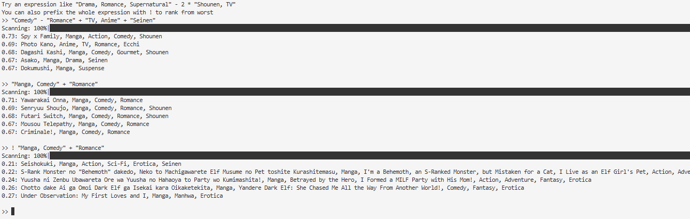

# anitag2vec

anitag2vec is a vector embedding primarily focused on Danbooru, Sakugabooru, Pixiv, MAL, etc type of tags.

# Why?

If you have your own local gallery or index of things you like, which, to be fair you most likely probably don't BUT having a recommendation system is quite laborious without a fuzzy component to it.

I mean, sure you can do tag based statistics but you will have to manually group similar tags and somehow also account for spelling variation. With a vector embedding, problem solved! Just pin something you like then get recommended co**similar** stuff.

There are many off-the-shelf vector embeddings, but they are primarily designed for general-purpose tasks such as sentence embeddings. While you can still adapt them for other use cases, many models are sensitive to token order and the exact phrasing of inputs.

# Setup

```bash
pip install torch tokenizers tqdm asciichartpy
```

The model checkpoints are available [HERE](https://huggingface.co/michael-0acf4/anitag2vec).

See the notebook [src/ranked_inference.ipynb](src/ranked_inference.ipynb) for a concrete inference example.

You can also explore the model's capabilities by composing embeddings using +, *, -, /.

```bash
python src/interactive.py
```

Here for example, we look for the closest entries to the expression within [this MAL style dataset](./data/mal_5a250b8b201ace01.json).



# Architecture

You can refer to [my blog post](https://blog.afmichael.dev/posts/2026/set-embeddings-and-anitag2vec/) in which I detail the design decisions and also how it works.
